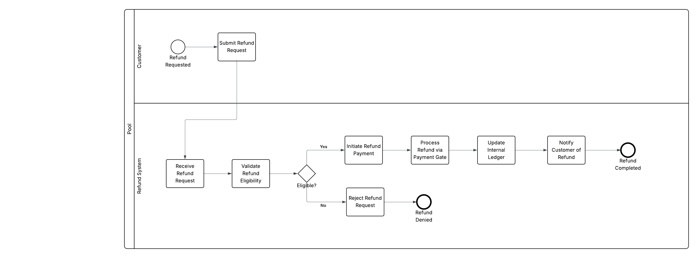
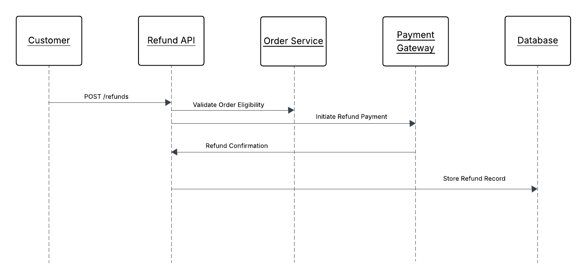
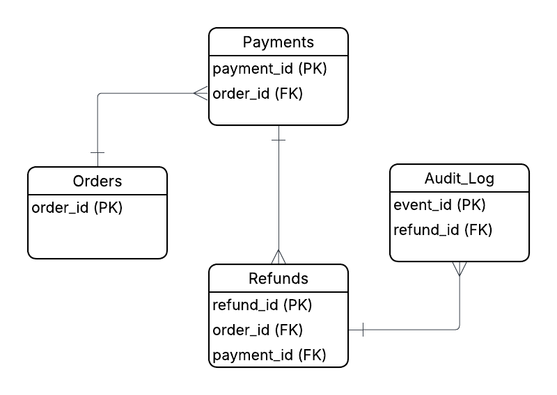

# SysCd

## Systems Analysis Portfolio

Portfolio showcasing process modelling, system design documentation, and technical analysis work.

Focused on:

- Systems analysis & business process modelling
- API/system interaction design
- Data modelling & traceability
- Technical problem decomposition

---

## Featured Project — Payment Refund Automation

Systems analysis case study focused on designing an automated refund workflow.

### Deliverables

- BPMN process workflow modelling
- UML sequence diagram (system/API interaction)
- ERD data model (orders, payments, refunds, audit logs)

### Focus Areas

- Transaction traceability
- Workflow optimisation
- System interaction clarity
- Operational reliability

---

## Core Skills

### Systems Analysis

- BPMN workflow modelling
- UML sequence diagrams
- ERD/data modelling
- Process optimisation

### Technical Understanding

- API interaction modelling
- System architecture thinking
- Technical documentation
- Problem decomposition

---

## Projects

- Refund-System-Design - End-to-end refund workflow modelling

---

## Project Artefacts - Refund Automation

All diagrams created using BPMN 2.0, UML sequence modelling, and ERD data modelling standards.

### BPMN Workflow

### UML Sequence Diagram

### ERD Data Model

